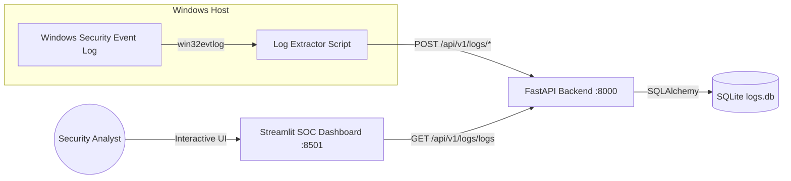

# 🛡️ Windows Security Monitor

[](https://www.python.org/)
[](https://fastapi.tiangolo.com/)
[](https://streamlit.io/)
[](https://plotly.com/)
[](https://www.sqlite.org/)

**Windows Security Monitor** is a real-time endpoint security and authentication monitoring solution. It captures Windows Security Event logs (Logon Success & Failure), ingests them through a FastAPI service into a persistent SQLite database, and visualizes them on a SOC-inspired Streamlit dashboard with proactive brute-force detection and interactive analytics.

---

## 📸 Overview & Architecture



---

## ✨ Features

- **🔍 Windows Security Log Extraction**: Automatically scans Windows Event Logs for logon events using `pywin32` (`win32evtlog`).
- **🚨 Event ID Monitoring**:
  - `4624` — Successful Account Logon
  - `4625` — Failed Account Logon Attempt
- **⚡ High-Performance REST API**: Built with **FastAPI** and **SQLAlchemy** for storing, structuring, and querying authentication logs.
- **📊 SOC Dark-Themed Dashboard**:
  - **KPI Metric Cards**: Total events, successful vs. failed logins, and failure rate percentage.
  - **Threat Alert Banners**: Automated alert detection for potential brute-force or credential stuffing attacks.
  - **Interactive Visualizations (Plotly)**:
    - *Event Distribution* (Donut chart)
    - *Failed Logons by Target Account* (Horizontal Bar chart)
    - *Activity Timeline* (Time-series Area chart)
  - **Event Explorer & Full-Text Search**: Filter by status, username, workstation, or timestamp.
  - **Event Simulator**: Sidebar tool to simulate and test authentication events on the fly.

---

## 📁 Project Structure

```text
log-reader/
├── app/
│   ├── database/
│   │   └── db.py                 # SQLAlchemy database session & engine
│   ├── models/
│   │   └── models.py             # SQLite ORM models for security logs
│   ├── routers/
│   │   └── logs_router.py        # API routing for ingestion and retrieval
│   ├── schemas/
│   │   └── schemas.py            # Pydantic data schemas
│   ├── scripts/
│   │   └── log_extractor.py      # Windows Security Event Log harvester
│   ├── services/
│   │   └── logs_service.py       # Log processing and DB queries
│   └── dashboard.py              # Streamlit SOC visual dashboard
├── logs.db                       # Local SQLite database
├── main.py                       # FastAPI entrypoint
├── pyproject.toml                # Project metadata & dependencies
├── requirements.txt              # Pip requirements
└── README.md                     # Project documentation
```

---

## 🚀 Getting Started

### 1. Prerequisites

- **Operating System**: Windows 10/11 or Windows Server (required for `pywin32` event extraction)
- **Python**: `3.11` or higher
- **Package Manager**: `uv` (recommended) or `pip`

---

### 2. Installation

Clone the repository and install the dependencies:

```bash
# Clone the repository
git clone https://github.com/kevine243/Windows-Security-Monitor.git
cd Windows-Security-Monitor

# Using uv (recommended)
uv sync

# OR using standard pip
python -m venv .venv
.venv\Scripts\activate
pip install -r requirements.txt
```

---

### 3. Running the Application

You can run the system in three parts:

#### A. Start the FastAPI Backend
```bash
python main.py
```
* The API will start at: `http://localhost:8000`
* Interactive API Documentation (Swagger UI): `http://localhost:8000/docs`

#### B. Launch the Security Dashboard
In a new terminal window:
```bash
streamlit run app/dashboard.py
```
* The dashboard will open in your browser at: `http://localhost:8501`

#### C. Run the Windows Log Extractor (Optional)
To stream live authentication logs from your local Windows machine:
```bash
python -m app.scripts.log_extractor
```
> **Note**: Accessing Windows Security logs may require running the terminal as **Administrator**.

---

## 📡 API Reference

| Method | Endpoint | Description |
|---|---|---|
| `GET` | `/` | Health check endpoint |
| `GET` | `/api/v1/logs/logs` | Fetch all logged security events |
| `POST` | `/api/v1/logs/successful_login` | Ingest Event ID 4624 (Success) |
| `POST` | `/api/v1/logs/failed_login` | Ingest Event ID 4625 (Failed) |

---

## 🛡️ Monitored Security Event IDs

| Event ID | Name | Description |
|:---:|---|---|
| **4624** | Successful Logon | An account was successfully logged on. |
| **4625** | Failed Logon | An account failed to log on (wrong password, unknown user, locked account, etc.). |

---

## 📄 License

This project is licensed under the [MIT License](LICENSE) (or your preferred open source license).
